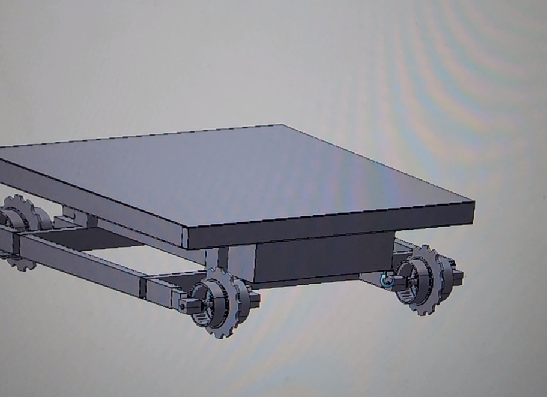
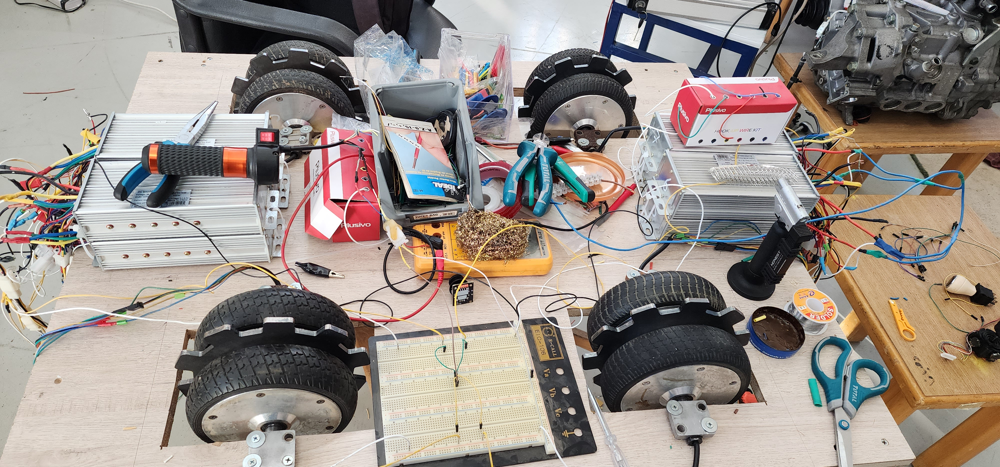
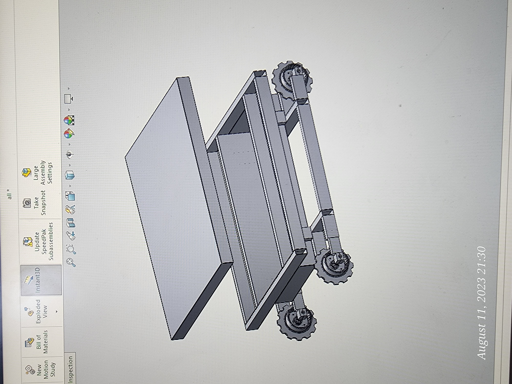
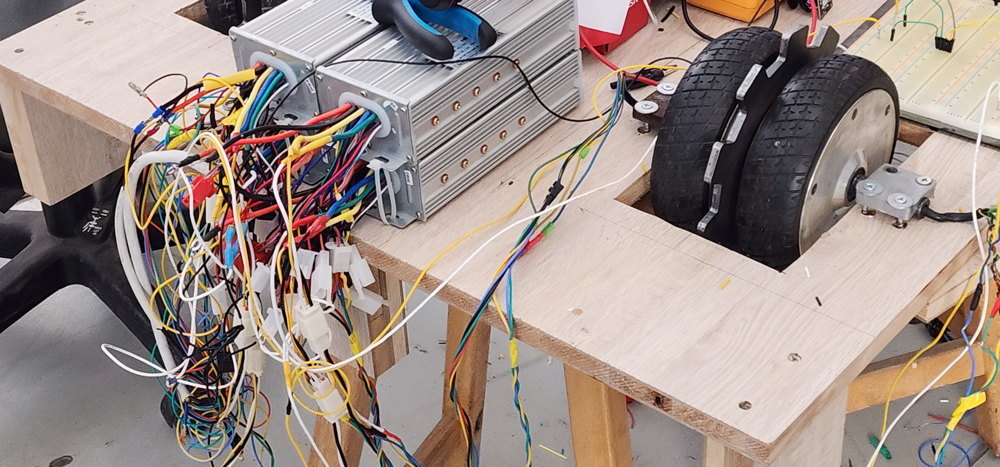
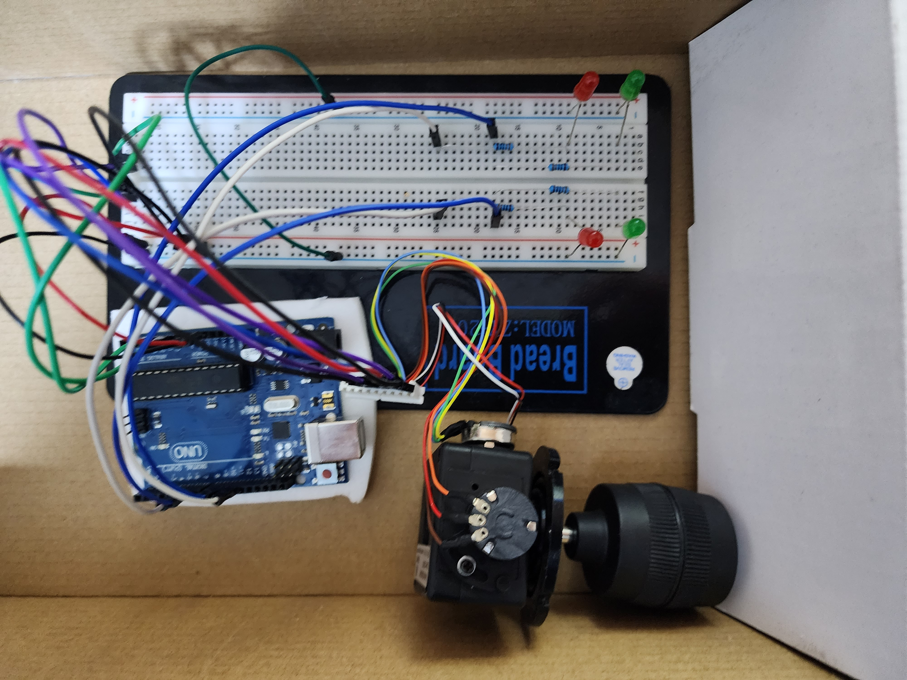

# Tracked Robotic Platform — 350 kg Payload Class

A four-corner tracked ground platform designed at the Autonomous Platforms Lab (APL), Jordan University of Science and Technology, targeting a 350 kg payload for warehouse logistics and defense applications.

This repository documents the mechanical design, the drivetrain, the wiring, and the control validation work that was completed — and the system plan that was not.

## Status

**Halted.** Drivetrain integration, wiring, and joystick control were built and validated on a bench rig. Frame fabrication and power integration did not proceed after external project funding was withdrawn. Everything in the *Built* sections below was completed and tested; everything in *Planned* was designed but never executed.

## Design target

| Parameter | Value |
|---|---|
| Payload class | 350 kg |
| Locomotion | Tracked, four driven corners |
| Drivetrain | Paired BLDC hub motors per corner |
| Applications | Warehouse logistics, defense |
| My role | Mechanical design, drivetrain integration, wiring harness, control validation |

---

## Built

### Drivetrain — repurposed hoverboard hub motors

Hoverboard hub motors were selected over purpose-built industrial motors for one reason: budget. They are inexpensive, available locally, and arrive as a complete unit — motor, hub, and tyre integrated.

A single unit cannot deliver the torque this payload class needs, so **two motors were paired back-to-back at each corner**, doubling available drive torque per station.

### Machined sprockets

Custom sprockets were designed in SolidWorks and **CNC-machined**, then mounted between each pair of wheels to carry the rubber tracks. This was the only custom-fabricated mechanical part in the build, and it is what makes tracked locomotion possible using off-the-shelf hub motors.

### Chassis design

The frame was designed around **standard steel tube sections available on the local market**, so that fabrication would need cutting and welding only — no custom extrusion, no machined structural parts. Designing to available stock rather than to an ideal geometry was a deliberate cost decision.

CAD source files are not published in this repository.

### Wiring harness

The full harness was fabricated by hand — soldered joints, heat-shrink insulation, crimped connectors — and wired into industrial BLDC controllers with throttle inputs for bench testing.

### Control validation — joystick with an LED test rig

Control was designed around a single joystick: analogue axes read on an Arduino and mixed into independent left and right drive commands, which is the standard differential mixing used for tracked and skid-steer steering.

Rather than test that logic by energising four pairs of high-current motors, I built a **low-power indicator rig first**: four LEDs on a breadboard, one pair per side. Green lights when that side is commanded forward, red when it is commanded reverse.

This made the mixing logic directly observable. Every joystick position — forward, reverse, pivot turn, arc turn — could be verified at a glance, on the bench, with no risk of a wiring fault driving a full-power drivetrain into something. Only after the logic was confirmed correct were the motors connected.

**Result: joystick control was completed and worked correctly, and the wheels were driven successfully under it.**

---

## Planned but not executed

The following was designed and specified, but the project stopped before any of it was built.

### Power

Battery cells were salvaged from a **Nissan Leaf pack**, disassembled to cell level, and intended for installation inside the chassis. The cells were extracted; they were never installed or wired. Integrating them would have required a battery management system, fusing, and a proper enclosure before the platform could be powered safely — none of which was reached.

### Suspension and tracks

- Weld the steel tube frame from the designed sections
- Add sprung idler/support wheels along the underside
- Fit the rubber tracks over the machined sprockets

### Payload and sensing

- LiDAR for perception
- A modular top deck: a seat for a human operator, removable so a robotic arm could be mounted in its place instead
- Auxiliary controls on buttons alongside the primary joystick

### Exhibition

The platform was intended for exhibition at **SOFEX**, positioned for warehouse logistics and defense use. It was never shown.

---

## What I would do differently

- Specify motor and controller ratings against the 350 kg target from the start, rather than validating capability after selecting hardware on price and availability.
- Instrument the bench rig with current measurement, to characterise torque under load instead of relying on qualitative response.
- Sequence power integration earlier. Leaving the battery to the end meant that when funding stopped, the platform had a working drivetrain and no way to run untethered.

## Acknowledgement

This project was conceived, supervised, and personally funded by
Dr. Yahia M. Al-Smadi at the Autonomous Platforms Lab, JUST.
Work stopped when he relocated.

This repository documents my own contribution to the project:
mechanical design, drivetrain integration, wiring, and control validation.

---

**Author:** Huthaifa Foudeh
**Lab:** Autonomous Platforms Lab (APL), JUST — Supervisor: Dr. Yahia M. Al-Smadi
**Period:** 2023
